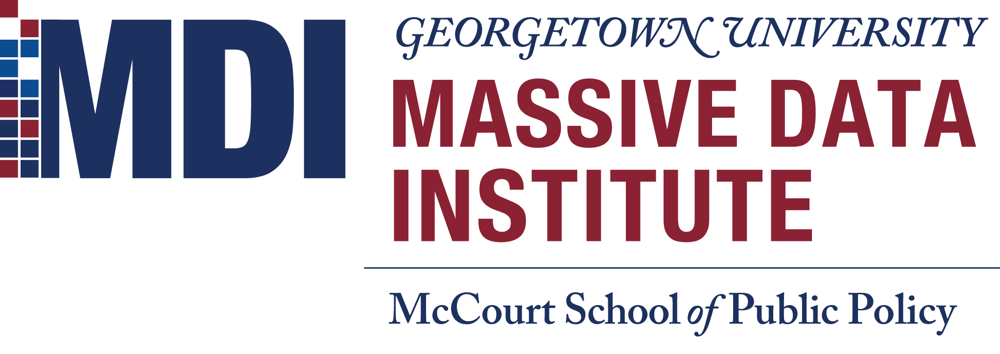

# Natural language processing: An introduction in Python
## A workshop with the [Massive Data Institute](https://mccourt.georgetown.edu/research/the-massive-data-institute/), Georgetown University

[](https://mybinder.org/v2/gh/jhaber-zz/nlp-python-2020/master)


## Overview

This workshop will equip newcowers to natural language processing or NLP (with some Python know-how) with a foundation for applying NLP methods in their work. The focus is on common steps in an NLP research workflow and user-friendly implementations of popular packages and methods. 

We will first go through the common “preprocessing recipe” used as for a variety of applications and NLP techniques. This includes: a) tokenization; b) removing stopwords, punctuation, and numbers; c) stemming/lemmatizing words; d) calculation of word frequencies / proportions; and e) part of speech tagging. We will then go over simple dictionary methods (including sentiment analysis) using a bag-of-words approach.

## Workshop goals

* Build intuitions about opportunities and limitations for using text as data
* Understand at a high-level:
  - how a few primary NLP methods work
  - what kinds of questions they answer
  - how to design and implement an NLP project
* Gain practice with: 
  - preprocessing text data
  - common steps in NLP
  - dictionary methods
  - NLTK and Scikit-learn
* Acquire resources for further learning

## Prerequisites

We will get our hands dirty implementing basic natural language processing tools and methods. To follow along with the code—which is the point—will need some familiarity with Python and Jupyter Notebooks. If you haven't programmed in Python or haven’t used Jupyter Notebooks, please do some self-teaching before this workshop using resources like those listed below. 

## Getting started & software prerequisites

For simplicity, just click the "Launch Binder" button to create a virtual environment ready for this workshop. 

If you want to run the code on your computer, you have two options. You could use [Anaconda](https://www.anaconda.com/what-is-anaconda/) to make installation easy: [download Anaconda](https://www.anaconda.com/download/) . Or if you already have Python 3.x installed with the full list of libraries listed under `requirements.txt`, you're welcome to clone this repository and follow along on your own machine. You can also install all the necessary packages like so: 

```
pip3 install -r requirements.txt
```

## Open-Access, Online Resources on Python and NLP

* [Introduction to Jupyter Notebooks (Real Python)](https://realpython.com/jupyter-notebook-introduction/)
* [Quick Python intro (a Jupyter Notebook)](https://github.com/jhaber-zz/nlp-python-2020/blob/master/solutions/intro-to-python.ipynb)
* [Great book on Python (with exercises): “Python for Everybody” (Charles Severance)](https://www.py4e.com/book.php)
* [Official Python Tutorial](https://docs.python.org/3/tutorial/index.html)
* [NLP course & scripts, for social scientists & digital humanists (Laura Nelson)](https://github.com/lknelson/text-analysis-course)
* [NLP textbook (Jurafsky & Martin @ Stanford)](https://web.stanford.edu/~jurafsky/slp3/)
* [Book on NLTK (NLTK team)](http://www.nltk.org/book/)
* [Datasets for NLP (Hugging Face)](https://github.com/huggingface/datasets)
* [Intro to SpaCy and NLP concepts (Allison Parrish)](https://gist.github.com/aparrish/f21f6abbf2367e8eb23438558207e1c3)
* [Workshops on NLTK and SpaCy (Geoff Bacon @ D-Lab)](https://github.com/geoffbacon/nlp-with-nltk-spacy)

## Contributing

If you spot a problem with these materials, please make an issue describing the problem.

## Acknowledgments

* [D-Lab at the University of California, Berkeley](https://dlab.berkeley.edu/)
* [Summer Institute in Computational Social Science](https://sicss.io/)
* [Laura Nelson](http://www.lauraknelson.com)
* [Geoff Bacon](https://geoffbacon.github.io/)
* [Ben Gebre-Medhin](http://gebre-medhin.com)
* [David Bamman](https://people.ischool.berkeley.edu/~dbamman/)

<br>


